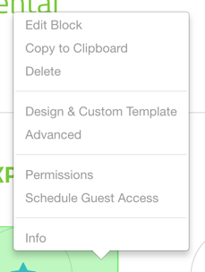
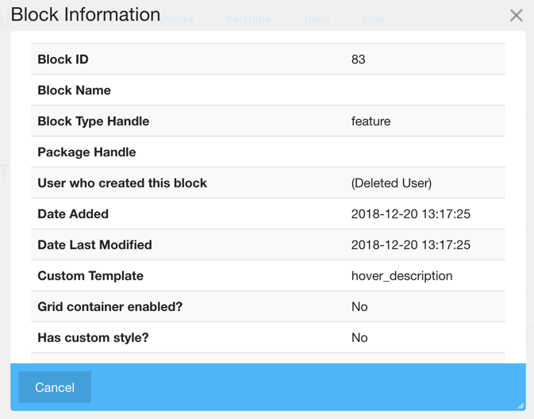
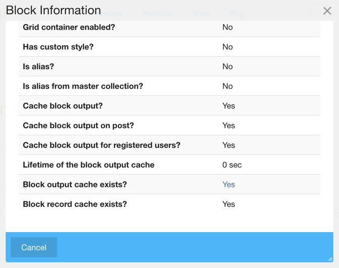
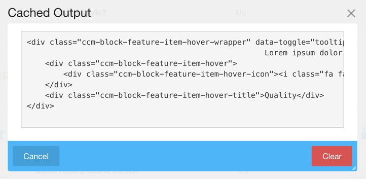

# Advanced Block Menu Add-on

Add "Information" menu item useful for developers in the block menu.

* Get basic block information like ID, btHandle, pkgHandle, etc.
* Get design information like custom template or custom style with single click.
* Get cache settings and status. Also enable to clear block output cache.

This package is also an example implementation of:

* Adding new item in the core context menu from package
* Adding new routes with new routing system introduced from 5.8.0a2 from package

## Screenshots

Block Menu

Block Information Window

Block output cache window

